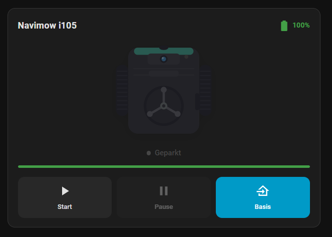

# Navimow Card

[](https://github.com/hacs/integration)

Lovelace-Karte für den Navimow Mähroboter – angelehnt an die Vacuum-Karte, jedoch ohne Karte.



## Funktionen

- Status-Anzeige mit animiertem Icon (Mäht / Pausiert / Kehrt zurück / Geparkt / Fehler)
- Schaltflächen: **Start**, **Pause**, **Zur Ladestation**
- Batteriestand mit farbigem Indikator und Fortschrittsbalken
- Keine externen Abhängigkeiten – vollständig eigenständig

## Installation via HACS

1. HACS öffnen → **Dashboard** → Drei-Punkte-Menü → **Benutzerdefinierte Repositories**
2. URL eingeben: `https://github.com/dgirod/mowercard`
3. Kategorie: **Dashboard** → **Hinzufügen**
4. Repository in der Liste suchen → **Herunterladen**
5. Home Assistant neu laden (Browser-Cache leeren: `Strg+Umschalt+R`)

## Manuelle Installation

1. `navimow-card.js` nach `/config/www/navimow-card.js` kopieren
2. **Einstellungen → Dashboards → Ressourcen** → Hinzufügen:
   - URL: `/local/navimow-card.js`
   - Typ: `JavaScript-Modul`
3. Browser neu laden

## Konfiguration

```yaml
type: custom:navimow-card
entity: lawn_mower.navimow_mein_gaerter   # Pflichtfeld
name: Navimow                              # Optional
battery_entity: sensor.navimow_battery    # Optional – wird meist automatisch erkannt
```

### Optionen

| Option           | Typ    | Pflicht | Beschreibung                                          |
|------------------|--------|:-------:|-------------------------------------------------------|
| `entity`         | string | ✅      | Entity-ID der `lawn_mower`-Entität                    |
| `name`           | string | –       | Anzeigename (Standard: `friendly_name` der Entität)   |
| `battery_entity` | string | –       | Entity-ID des Batteriesensors (sonst auto-erkannt)    |

## Unterstützte Zustände

| Zustand     | Anzeige         | Farbe             |
|-------------|-----------------|-------------------|
| `mowing`    | Mäht            | Grün (pulsierend) |
| `docked`    | Geparkt         | Grau              |
| `paused`    | Pausiert        | Orange            |
| `returning` | Kehrt zurück    | Blau              |
| `error`     | Fehler          | Rot               |
| `idle`      | Bereit          | Grau              |
